# Automated Workflows Documentation

This document describes the automated GitHub Actions workflows that maintain SDK health and synchronization with Port.io API.

---

## 📋 Overview

| Workflow | Schedule | Purpose | Duration |
|----------|----------|---------|----------|
| **OpenAPI Sync** | Daily 2 AM UTC | Sync with Port.io API | ~5 min |
| **Daily Health Check** | Daily 8 AM UTC | SDK health monitoring | ~3 min |

---

## 1. OpenAPI Sync Workflow

**File:** `.github/workflows/openapi-sync.yml`  
**Schedule:** Daily at 02:00 UTC  
**Trigger:** Automatic (cron) + Manual

### Purpose

Automatically keeps the SDK synchronized with the latest Port.io API by:
1. Downloading the latest OpenAPI specification
2. Regenerating TypeScript types
3. Running comprehensive checks
4. Creating PRs for non-breaking changes
5. Creating issues for breaking changes

### Workflow Steps



```mermaid
graph TD
    A[Download OpenAPI Spec] --> B{Changes Detected?}
    B -->|No| C[✅ Exit - No Action]
    B -->|Yes| D[Generate TypeScript Types]
    D --> E[Run Type Check]
    E --> F[Run Tests]
    F --> G[Run Build]
    G --> H{All Checks Pass?}
    H -->|Yes| I[Create Pull Request]
    H -->|No| J[Create Issue]
    I --> K[✅ Complete]
    J --> K
```

### What Happens When Changes Are Detected

#### ✅ Non-Breaking Changes (Success Path)

When API changes don't break the SDK:

1. **Automatic PR Created**
   - Branch: `auto-sync/openapi-{run_number}`
   - Title: `🔄 Auto-sync: OpenAPI Spec Update`
   - Labels: `automated`, `openapi-sync`, `dependencies`

2. **PR Contents**
   - Updated `openapi.json`
   - Regenerated `src/types/api.ts`
   - All checks passed (type check, tests, build)

3. **Action Required**
   - Review the changes
   - Check if new endpoints were added
   - Update `API_COVERAGE_ANALYSIS.md` if needed
   - Merge the PR

**Example PR:**
```
🔄 Auto-sync: OpenAPI Spec Update

## 🤖 Automated OpenAPI Sync

This PR was automatically generated by the daily OpenAPI sync workflow.

### Changes
- ✅ Downloaded latest OpenAPI spec from Port.io
- ✅ Regenerated TypeScript types
- ✅ Type check passed
- ✅ Tests passed
- ✅ Build successful

### Verification
- [x] OpenAPI spec updated
- [x] Types regenerated
- [x] Type check passed
- [x] All tests passing
- [x] Build successful
```

#### ⚠️ Breaking Changes (Failure Path)

When API changes break the SDK:

1. **Issue Created Automatically**
   - Title: `⚠️ OpenAPI Sync Failed - Breaking Changes Detected`
   - Labels: `bug`, `openapi-sync`, `breaking-change`, `urgent`

2. **Issue Contents**
   - Status of each check (download, type gen, type check, tests, build)
   - Link to workflow run
   - Guidance on what to check
   - Action items

3. **Action Required**
   - Review the workflow run logs
   - Check the OpenAPI diff
   - Update SDK code to handle API changes
   - Update tests
   - Manually trigger workflow after fixes

**Example Issue:**
```
⚠️ OpenAPI Sync Failed - Breaking Changes Detected

## 🚨 OpenAPI Sync Alert

The automated OpenAPI sync detected changes that broke the build.

### Status
- Download: ✅
- Type Generation: ✅
- Type Check: ⚠️ FAILED
- Tests: ⚠️ FAILED
- Build: ✅

### Likely Causes
- Port.io API introduced breaking changes
- New required fields added to existing types
- Endpoints were removed or renamed
- Response schema changes

### Action Required
1. Review the workflow run
2. Check the OpenAPI diff for breaking changes
3. Update SDK code to handle API changes
4. Update tests if needed
5. Manually trigger workflow after fixes
```

### Manual Trigger

You can manually trigger the workflow:

```bash
# Via GitHub CLI
gh workflow run openapi-sync.yml

# Via GitHub UI
Actions → OpenAPI Sync & Build Check → Run workflow
```

### Configuration

**Environment Variables:**
- None required (uses public Port.io API)

**Secrets:**
- `GITHUB_TOKEN` (automatically provided)

**Schedule:**
- Daily at 02:00 UTC
- Can be changed in the workflow file

---

## 2. Daily Health Check Workflow

**File:** `.github/workflows/daily-health-check.yml`  
**Schedule:** Daily at 08:00 UTC  
**Trigger:** Automatic (cron) + Manual

### Purpose

Monitors the overall health of the SDK by:
1. Checking for security vulnerabilities
2. Detecting outdated dependencies
3. Running type checks
4. Running tests
5. Checking test coverage
6. Building the SDK

### Workflow Steps



```mermaid
graph TD
    A[Security Audit] --> B[Check Outdated Deps]
    B --> C[Type Check]
    C --> D[Run Tests]
    D --> E[Check Coverage]
    E --> F[Build SDK]
    F --> G{All Healthy?}
    G -->|Yes| H[✅ Complete]
    G -->|No| I[Create Issue]
    I --> H
```

### Health Checks

| Check | Pass Criteria | Action on Failure |
|-------|---------------|-------------------|
| Security Audit | 0 critical, 0 high | Create issue (urgent) |
| Outdated Deps | Informational only | Log only |
| Type Check | 0 errors | Create issue |
| Tests | All passing | Create issue |
| Coverage | Report only | Log percentage |
| Build | Success | Create issue |

### What Happens on Health Issues

**Issue Created:**
- Title: `⚠️ Daily Health Check Failed`
- Labels: `bug`, `health-check`, `automated`

**Issue Contents:**
```
🏥 SDK Health Check Alert

The daily health check detected issues with the SDK.

### Status
- Security Audit: ⚠️ (Critical: 2, High: 3, Moderate: 5)
- Type Check: ✅
- Tests: ❌
- Build: ✅
- Coverage: 86.6%

### Action Required
- 🔒 **URGENT:** Fix security vulnerabilities
- Fix failing tests

### Workflow Run
https://github.com/org/repo/actions/runs/123456
```

### Security Vulnerability Response

| Severity | Response Time | Action |
|----------|---------------|--------|
| **Critical** | 24 hours | Immediate fix |
| **High** | 7 days | Priority fix |
| **Moderate** | 30 days | Regular fix |
| **Low** | Next cycle | Backlog |

### Manual Trigger

```bash
# Via GitHub CLI
gh workflow run daily-health-check.yml

# Via GitHub UI
Actions → Daily Health Check → Run workflow
```

---

## 3. Integration with Existing Workflows

These automated workflows complement existing CI/CD workflows:

### Existing Workflows

| Workflow | Trigger | Purpose |
|----------|---------|---------|
| **Build** | Push, PR | Build verification |
| **Test** | Push, PR | Test execution |
| **Type Check** | Push, PR | TypeScript validation |
| **Security** | Push, PR | Security scanning |

### Workflow Relationship

```
┌─────────────────────────────────────────┐
│         Developer Workflow              │
│  (Push/PR triggers existing workflows)  │
└─────────────────────────────────────────┘
                    ↓
        ┌───────────────────────┐
        │   Immediate Checks    │
        │   - Build             │
        │   - Test              │
        │   - Type Check        │
        │   - Security          │
        └───────────────────────┘

┌─────────────────────────────────────────┐
│      Automated Daily Workflows          │
│  (Scheduled - no developer action)      │
└─────────────────────────────────────────┘
                    ↓
        ┌───────────────────────┐
        │  Proactive Monitoring │
        │  - OpenAPI Sync       │
        │  - Health Check       │
        │  - Dependency Audit   │
        └───────────────────────┘
```

---

## 4. Notifications

### GitHub

✅ **Automatic:**
- Pull requests created for successful syncs
- Issues created for failures
- Workflow status in Actions tab

### Slack (Optional)

To enable Slack notifications:

1. Create a Slack webhook
2. Add to GitHub secrets: `SLACK_WEBHOOK_URL`
3. Uncomment Slack notification steps in workflows

Example:
```yaml
- name: Notify on Slack
  if: failure()
  run: |
    curl -X POST -H 'Content-type: application/json' \
      --data '{"text":"⚠️ OpenAPI sync failed!"}' \
      ${{ secrets.SLACK_WEBHOOK_URL }}
```

### Email

GitHub automatically emails:
- Repository admins on workflow failures
- Configurable in Settings → Notifications

---

## 5. Monitoring & Debugging

### View Workflow Runs

```bash
# List recent runs
gh run list --workflow=openapi-sync.yml --limit 10

# View specific run
gh run view <run-id>

# Watch a running workflow
gh run watch
```

### Check Workflow Status

```bash
# View workflow status
gh workflow view openapi-sync.yml

# View all workflows
gh workflow list
```

### Download Logs

```bash
# Download logs for a run
gh run download <run-id>
```

### Workflow Metrics

Track in GitHub Insights:
- Success rate
- Average duration
- Failure reasons
- Trend over time

---

## 6. Troubleshooting

### OpenAPI Sync Issues

**Issue:** Workflow fails to download OpenAPI spec

**Solution:**
```bash
# Test manually
curl https://api.port.io/static/openapi.json

# Check if URL changed
# Update workflow file if needed
```

**Issue:** Type generation fails

**Solution:**
```bash
# Test locally
pnpm types:download
pnpm types:generate

# Check for syntax errors in openapi.json
```

**Issue:** False positives (changes detected but no real changes)

**Solution:**
- OpenAPI spec may have timestamp changes
- Consider adding timestamp filtering in diff check

### Health Check Issues

**Issue:** Workflow reports false failures

**Solution:**
- Check if tests are flaky
- Verify environment matches local
- Review recent changes

**Issue:** Too many notifications

**Solution:**
- Adjust audit level (currently `moderate`)
- Filter out specific vulnerability types
- Configure notification preferences

---

## 7. Maintenance

### Updating Workflows

**When to update:**
- Port.io changes OpenAPI URL
- Node.js version upgrade
- pnpm version upgrade
- Add new checks
- Modify notification preferences

**How to update:**
```bash
# Edit workflow file
vim .github/workflows/openapi-sync.yml

# Test with manual trigger
gh workflow run openapi-sync.yml

# Monitor the run
gh run watch
```

### Disabling Workflows

**Temporary disable:**
```bash
# Disable workflow
gh workflow disable openapi-sync.yml

# Re-enable later
gh workflow enable openapi-sync.yml
```

**Permanent disable:**
- Delete the workflow file
- Or comment out the `schedule:` trigger

### Adjusting Schedule

Change cron expression in workflow file:

```yaml
schedule:
  # Every day at 2 AM UTC
  - cron: '0 2 * * *'
  
  # Every 6 hours
  # - cron: '0 */6 * * *'
  
  # Every Monday at 9 AM UTC
  # - cron: '0 9 * * 1'
  
  # Twice daily (6 AM and 6 PM UTC)
  # - cron: '0 6,18 * * *'
```

[Cron expression helper](https://crontab.guru/)

---

## 8. Best Practices

### ✅ Do

- Review automated PRs within 24 hours
- Investigate issues immediately (especially security)
- Keep workflow files updated with SDK changes
- Monitor workflow success rate
- Document any custom modifications

### ❌ Don't

- Ignore automated issues
- Disable workflows without good reason
- Merge automated PRs without review
- Commit secrets to workflow files
- Skip security vulnerability fixes

---

## 9. Cost Considerations

### GitHub Actions Usage

**Free Tier:**
- 2,000 minutes/month for private repos
- Unlimited for public repos

**These Workflows:**
- OpenAPI Sync: ~5 min/day = 150 min/month
- Health Check: ~3 min/day = 90 min/month
- **Total: ~240 min/month** (12% of free tier)

**Cost:** Free for public repos, minimal for private repos

---

## 10. Security Considerations

### Workflow Permissions

```yaml
permissions:
  contents: write  # For creating PRs
  issues: write    # For creating issues
  pull-requests: write  # For PR management
```

### Secret Management

- Never commit secrets to workflow files
- Use GitHub Secrets for sensitive data
- Rotate secrets regularly
- Use least privilege principle

### Token Security

- `GITHUB_TOKEN` is automatically provided
- Scoped to repository only
- Expires after workflow run
- Can't access other repositories

---

## 11. FAQ

**Q: How often should OpenAPI sync run?**  
A: Daily is recommended. Port.io doesn't change API frequently, but daily catches changes quickly.

**Q: What if I want to sync manually?**  
A: Use the "Run workflow" button in GitHub Actions UI or `gh workflow run openapi-sync.yml`

**Q: Can I adjust the schedule?**  
A: Yes, modify the cron expression in the workflow file.

**Q: What happens if both workflows run simultaneously?**  
A: They're scheduled at different times (2 AM and 8 AM UTC) to avoid conflicts.

**Q: Do I need Port.io credentials for these workflows?**  
A: No, OpenAPI spec is public. Only automated tests/smoke tests would need credentials.

**Q: How do I test workflows locally?**  
A: Use [act](https://github.com/nektos/act) to run GitHub Actions locally: `act -j sync-openapi`

---

## 12. Summary

### Benefits

✅ **Automation Benefits:**
- Catch API changes immediately
- No manual OpenAPI downloads
- Automatic type regeneration
- Proactive health monitoring
- Early detection of breaking changes
- Continuous dependency security

✅ **Time Savings:**
- ~2 hours/week saved on manual checks
- ~30 minutes/week saved on security audits
- ~1 hour/week saved on dependency updates

✅ **Risk Reduction:**
- Catch breaking changes before users
- Detect security vulnerabilities early
- Maintain SDK health automatically
- Prevent technical debt accumulation

---

## Related Documentation

- [GitHub Actions Documentation](https://docs.github.com/en/actions)
- [Cron Expression Reference](https://crontab.guru/)
- [API Coverage Analysis](../../API_COVERAGE_ANALYSIS.md)
- [Contributing Guide](../../CONTRIBUTING.md)

---

**Last Updated:** October 5, 2025  
**Maintained By:** Repository maintainers  
**Review Frequency:** Quarterly or when workflows change
